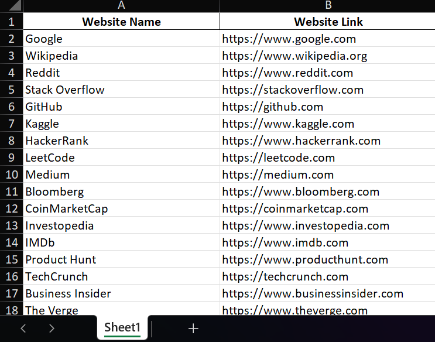
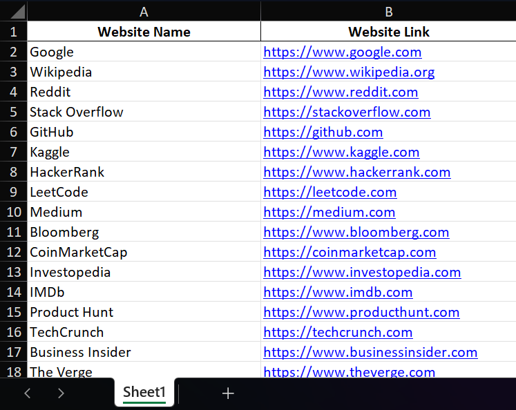

# Excel-Hyperlink-Converter-Bot

A Python bot that automatically converts and manages hyperlinks in Excel files.

## Features
- Extract URLs from Excel cells
- Convert text to clickable hyperlinks
- Batch process multiple spreadsheets
- Clean and manage hyperlinks automatically

## Installation
1. Clone the repository:
```bash
git clone https://github.com/Atul-Kumar002/Excel-Hyperlink-Converter-Bot.git
cd Excel-Hyperlink-Converter-Bot
```
2. Install dependencies:
```bash
pip install -r requirements.txt
```

## How to use
1. Add your Excel files that you want to use this bot for in the extracted folder.
2. Open Command Prompt and navigate to the extracted folder.
3. Make sure you have installed all the prerequisites, i.e.,
   ```bash
   pandas>=1.3.0
   openpyxl>=3.0.0
   tqdm>=4.60.0
   ```
4. ```bash
   python excel_hyperlink_bot.py
   ```
5. Choose the further option as per your requirement.

### Single File Processing
1. Choose 1.
   ```bash
   Enter your choice (1-6): 1
   ```
2. Type the complete file name with address(case sensitive).
   ```bash
   Enter the path to your Excel file: Website_Links.xlsx
   ```
   This will occur on your screen.
   ```bash
   📁 Processing: Website_Links.xlsx
   📏 Dimensions: 21 rows × 5 columns
   📊 Column A (Website Name): text (confidence: 21)
   📊 Column B (Website Link): website (confidence: 19)
   📊 Column C (Column C): unknown (confidence: 0)
   📊 Column D (Column D): unknown (confidence: 0)
   📊 Column E (Column E): text (confidence: 1)

   ✅ Conversion completed!
   🔗 Total hyperlinks created: 20
   💾 Saved as: Website_Links_with_hyperlinks.xlsx
   📂 Backup: backups\Website_Links.xlsx.backup_20251008_203700
   ```
   That's all, and your Excel sheet with the hyperlink is created in the folder.
3. Type "6" when you are done using the bot.

### Batch Processing
1. Choose 2.
   ```bash
   Enter your choice (1-6): 2
   ```
2. Type "." as a folder path.
    ```bash
    Enter the folder path: .
    ```
3. That's all, and all your Excel sheet with the hyperlink is created in the folder.
4. Type "6" when you are done using the bot.

## Getting Help
If you encounter issues:

Check the backups/ folder for original files

Verify your Excel file is not password-protected.

Ensure you have write permissions in the output directory

### Before Conversion


### After Conversion  


## Technical Details
### Architecture
excel_hyperlink_bot.py    
├── Core Detection Engine 
│   ├── Email validation with regex 
│   ├── URL pattern matching 
│   └── Content type analysis 
├── Processing Pipeline 
│   ├── File loading with OpenPyXL 
│   ├── Batch processing controller 
│   └── Progress tracking with TQDM 
├── Safety Systems 
│   ├── Automatic backup creation 
│   ├── Error handling and logging 
│   └── Configuration management 
└── User Interface 
    ├── Interactive menu system 
    ├── Real-time progress display 
    └── Log viewing interface 
    
### Key Algorithms
Smart Content Detection: Analyzes column data to identify linkable content

URL Validation: Comprehensive pattern matching for various URL formats

Batch Optimization: Efficient processing of large datasets

Error Recovery: Graceful handling of corrupted or invalid files.

# Contributing
We welcome contributions! Please feel free to submit pull requests or open issues for:
Bug fixes
New features
Documentation improvements
Performance enhancements
Development Setup
Fork the repository
Create a feature branch
Make your changes
Test thoroughly
Submit a pull request

## License
This project is licensed under the MIT License - see the [LICENSE](LICENSE) file for details.

##  Acknowledgments
Built with Python.
Uses pandas for data manipulation.
openpyxl for Excel file handling.
tqdm for progress bars.    

 # If this project helped you, please give it a star on GitHub!

    
